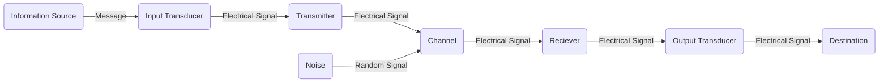

## **1. Database Management System (DBMS)**

### **1.1 Introduction to data, database, Database system, DBMS**

A computer is an electronic device, operating under the control of instructions stored in its own memory that can accept data (input), process the data according to specified rules, produce information (output), and store the information for future use.  
The physical parts that make up a computer (the central processing unit, input, output, and memory) are called hardware. Programs that tell a computer what to do are called software. A set of instructions that perform a particular task is called a program, software program, or software. Peripherals are any hardware device connected to a computer, any part of the computer outside the CPU and working memory. Some examples of peripherals are keyboards, the mouse, monitors, printers, scanners, disk and tape drives, microphones, speakers, joysticks, plotters, and cameras. Computer is an advanced electronic device that takes raw data as input from the user and processes these data under the control of set of instructions (called program) and gives the result (output) and saves output for the future use. It can process both numerical and non-numerical (arithmetic and logical) calculations.

### **1.2 Introduction to data, database, Database system, DBMS**

### **1.3 Advantages of using DBMS**

### **1.4 DDL (Data Definition Language) and DML (Data Manipulation Language)**

### **1.5 Database Model: Network Model, Hierarchical Model, Relational database model**

### **1.6 Concept of Normalization: 1NF, 2NF, 3NF**

### **1.7 Centralized Vs. Distributed Database**

### **1.8 Database Security**

## **2. Data Communication and Networking**

### **2.1 Basic elements of Communication System:**

Communication is the act of transmission of information. Every living creature within the world experiences the necessity to impart or receive information, virtually unceasingly, with alternatives in the closed world. For communication to be successful, it’s essential that the sender and the receiver perceive a standard language.
Humans have perpetually created endeavors to enhance the standard of communication with other human beings. Languages and the ways utilized in communication have been unbroken, evolving from prehistoric to fashionable times, to fulfil the growing demands in terms of speed and quality of information.  

Communication System that relies on the electronics means is known as Electronic Communication Systems and similarly Digital Communication System if the electronics are digital which are mostly used these days.  

> ***The basic components of a communication system are***  
>
i. Information Source  
ii. Transmitter  
iii. Communication Channel  
iv. Receiver  
v. Destination  
{: .prompt-tip}

***Information Source:***  

We know that communication systems are the art of information exchange. Therefore, to establish communication we need some type of information. This information originates from the information source.  
> The information generated by the source may be in the form of sound (human speech), picture (image source), words etc.
{: .prompt-tip}

***Transmitter:***  

The transmitter is a device which converts the signal produced by the source into a form that is suitable for transmission over a given channel or medium. Transmitters use a technique called modulation to convert the electrical signal into a form that is suitable for transmission over a given channel or medium.  

When we send the signal over larger distances, it undergoes various circumstances which makes the signal weak. To send the signals over larger distances, without the effect of any external interferences or noise addition and without getting faded away, it must undergo a process called modulation. Modulation increases the strength of a signal without changing the parameters of the original signal. Thus, the resulting signal overcomes the various effects which make it become weak.  

***Communication Channel:***

The communication channel is a medium through which the signal travels.  

>***Communication channels are divided into two categories:***
>
>i. Guided Channel  
>ii. Unguided Channel
>
>If the channel does not allow the signal following through the medium to escape out of medium, then it is said to be Guided Medium or channel otherwise it is Unguided Channel or Medium. For example, wired communication systems use guided medium as wire and wireless communications systems use unguided medium as open space.
{: .prompt-tip}

***Receiver:***

The receiver is a device that receives the signal from the channel and converts the signal back to its original form (light and sound) which is understandable by humans at the destination.  

***Destination:***

The destination is the final stage in the communication system. Generally, humans at some places are considered as the destination. A destination is a place where this information is supposed to be consumed.

### **2.2 Concept of Communication System**

The word Communication (derived from the Latin ‘Communicare’ it means ‘to share’) is the act of sharing ideas, emotions, and feelings between two or more people.  

We are aware of the need for and importance of communication as it is a general phenomenon. Nowadays communication is playing a vital role in every step of an individual. Wherever life exists, communication also exists.

The history of communication itself can be traced back since the origin of speech. The use of technology in communication may be considered since the first use of symbols about 30,000 years BCE. Among the symbols used, there are cave paintings, petroglyphs, pictograms and ideograms. Writing was a major innovation, as well as printing technology and, more recently, telecommunications and the Internet.

The history of telecommunication - the transmission of signals over a distance for the purpose of communication - began thousands of years ago with the use of smoke signals and drums in Africa, America and parts of Asia. In the 1790s the first fixed semaphore systems emerged in Europe however it was not until the 1830s that electrical telecommunication systems started to appear.

### **2.3 Block Diagram of communication System /Model**

### **2.4 Elements of Data Communication/Transmission**

[Refer to 2.1](/posts/Theory_12_Notes/#21-basic-elements-of-communication-system)

### **2.5 Simplex, Half duplex and Full duplex communication mode**

Data communication happens in the form of signals between two or more computing devices or nodes. The transfer  of  data  happens over a point-to-point  or multipoint communication channel. Data communication between different devices are broadly categorised into 3 types: Simplex communication, Halfduplex communication, and Full-duplex communication.

***Simplex Communication System***

In Simplex mode, the communication is unidirectional, as on a one-way street. Only one of the two devices on a link can transmit, the other can only receive. The simplex mode can use the entire capacity of the channel to send data in one direction.
Example: Keyboard and traditional monitors. The keyboard can only introduce input, the monitor can only give the output.

***Half Duplex Communication System***

In half-duplex mode, each station can both transmit and receive, but not at the same time. While one device is sending, the other can only receive, and vice versa. The half-duplex mode is used in cases where there is no need for communication in both directions at the same time. The entire capacity of the channel can be utilized for each direction.
Example: Walkie-talkie in which message is sent one at a time and messages are sent in both directions.

>Channel capacity = Bandwidth * Propagation Delay
{: .prompt-tip}

### **2.6 Concept of LAN and WAN**

***LAN***  

A local area network (LAN) is a network confined to a small, localized area. Home WiFi networks and small business networks are common examples of LANs. Typically, whoever manages the LAN also manages the networking equipment it uses. A small business, for instance, will manage the routers and switches involved in setting up the LAN.  

***WAN***  

A wide area network (WAN) is a large computer network that connects groups of computers over large distances. WANs are often used by large businesses to connect their office networks; each office typically has its own local area network, or LAN, and these LANs connect via a WAN. These long connections may be formed in several different ways, including leased lines, VPNs, or IP tunnels.  
A wide area network (WAN) is a large computer network that connects groups of computers over large distances. WANs are often used by large businesses to connect their office networks; each office typically has its own local area network, or LAN, and these LANs connect via a WAN. These long connections may be formed in several different ways, including leased lines, VPNs, or IP tunnels.  

### **2.7 Transmission Medium: Guided and Unguided**

A transmission medium is a system or substance that can mediate the propagation of signals for the purposes of telecommunication. Signals are typically imposed on a wave of some kind suitable for the chosen medium. For example, data can modulate sound, and a transmission medium for sounds may be air, but solids and liquids may also act as the transmission medium. Vacuum or air constitutes a good transmission medium for electromagnetic waves such as light and radio waves. While material substance is not required for electromagnetic waves to propagate, such waves are usually affected by the transmission media they pass through, for instance, by absorption or reflection or refraction at the interfaces between media. Technical devices can therefore be employed to transmit or guide waves. Thus, an optical fiber or a copper cable is used as transmission media.  

>For any networking to be effective, raw stream of data is to be transported from one device to other over some medium. Various transmission media can be used for transfer of data. These transmission media may be of two types −
>
>***Guided Medium***  
>
>In guided media, transmitted data travels through cabling system that has a fixed path. For example, copper wires, fibre optic wires, etc.
>
>***Unguided Medium***  
>
>In unguided media, transmitted data travels through free space in form of electromagnetic signal. For example, radio waves, lasers, etc.
{: .prompt-tip}

### **2.8 Transmission impairments terminology**

In the data communication system, analog and digital signals go through the transmission medium. Transmission media are not ideal. There are some imperfections in transmission mediums. So, the signals sent through the transmission medium are also not perfect. This imperfection cause **signal impairment**.

It means that signals that are transmitted at the beginning of the medium are not the same as the signals that are received at the end of the medium that is what is sent is not what is received. These impairments tend to deteriorate the quality of analog and digital signals.  

### Causes of impairment

***Jitter***

 Jitter is the deviation from true periodicity of a presumably periodic signal, often in relation to a reference clock signal. In clock recovery applications it is called timing jitter. Jitter is a significant, and usually undesired, factor in the design of almost all communications links.

 Jitter can be quantified in the same terms as all time-varying signals, e.g., root mean square (RMS), or peak-to-peak displacement. Also, like other time-varying signals, jitter can be expressed in terms of spectral density.

 Jitter may be caused by electromagnetic interference and crosstalk with carriers of other signals. Jitter can cause a display monitor to flicker, affect the performance of processors in personal computers, introduce clicks or other undesired effects in audio signals, and cause loss of transmitted data between network devices. The amount of tolerable jitter depends on the affected application.

***Echo***

As the name implies, echo in communication systems is the return of a talker's voice. It is most apparent to the talker himself or herself. Secondarily, it can also be an annoyance to the listener. To be an impairment, the returned voice must suffer some noticeable delay. Thus we can say that echo is a reflection of the voice. The cause of echo is impedance mismatches that might be present any place in the electrical communication connection. Echo is a major annoyance to the communication user. It affects the talker more than the listener. Two factors determine the degree of annoyance of echo: its loudness and its length of delay.

***Singing***

Singing is the result of sustained oscillations due to positive feedback in communication amplifiers or amplifying circuits. Circuits that sing are unusable and promptly overload multiplex equipment, particularly FDM equipment.

Singing may be regarded as echo that is completely out of control. This can occur at the frequency at which the circuit is resonant. Under such conditions the circuit losses at the singing frequency are so low that oscillation will continue, even after cessation of its original pulse.

***Crosstalk***

In electronics, crosstalk is any phenomenon by which a signal transmitted on one circuit or channel of a transmission system creates an undesired effect in another circuit or channel. Crosstalk is usually caused by undesired capacitive, inductive, or conductive coupling from one circuit or channel to another.

Crosstalk is a significant issue in structured cabling, audio electronics, integrated circuit design, wireless communication and other communications systems.

***Distortion***

Distortion means that the signal changes its form or shape. Distortion can occur in a composite signal made of different frequencies. Each signal component has its own propagation speed (see the next section) through a medium and, therefore, its own delay in arriving at the final destination. Differences in delay may create a difference in phase if the delay is not exactly the same as the period duration. In other words, signal components at the receiver have phases different from what they had at the sender. The shape of the composite signal is therefore not the same. Figure below shows the effect of distortion on a composite signal.  

***Noise***

Noise is another cause of impairment. Several types of noise, such as thermal noise, induced noise, crosstalk, and impulse noise, may corrupt the signal. Thermal noise is the random motion of electrons in a wire which creates an extra signal not originally sent by the transmitter. Induced noise comes from sources such as motors and appliances. These devices act as a sending antenna, and the transmission medium acts as the receiving antenna. Crosstalk is the effect of one wire on the other. One wire acts as a sending antenna and the other as the receiving antenna. Impulse noise is a spike (a sig- nal with high energy in a very short time) that comes from power lines, lightning, and so on. Figure below shows the effect of noise on a signal.  

***Bandwidth***

It is the maximum amount of data transmitted over an internet connection in a given amount of time. Bandwidth is often mistaken for internet speed when it's actually the volume of information that can be sent over a connection in a measured amount of time calculated in megabits per second (Mbps).  

Bandwidth is how much information you receive every second, while speed is how fast that information is received or downloaded. Let's compare it to filling a bathtub. If the bathtub faucet has a wide opening, more water can flow at a faster rate than if the pipe was narrower. Think of the water as the bandwidth and the rate at which the water flows as the speed.

***Number of receivers***

Number of devices or reciever connected to the communication system consumes some amount of power from the signal comming from the channel. Hence connecting recievers of devices to the network directly effect the performance and efficiency of the communication system. To omit these kinds of power issue we can use the power boosters or power injection technique. Although in digital network the more no of clients or reciver connected to the router or network devices may result in network congestion which may result in slower network and less efficient network.

### **2.9 Basic concept of Networks Architecture: Client-Server and Peer-to-peer**

Network architecture refers to the way network devices and nodes are structured or interconnected to serve the connectivity needs or accomplish the goal. Computer Network Architecture is defined as the physical and logical design of the software, hardware, protocols, and media of the transmission of data. Simply we can say that how computers are organized and how tasks are allocated to the computer.

***Client-Server***

Client-server architecture, architecture of a computer network in which many clients (remote processors) request and receive service from a centralized server (host computer). In a client/server network, a centralized, powerful computer(server) act as a hub in which other computers or workstations(clients) can connect to. This server is the heart of the system, which manages and provides resources to any client that requests them.

***Peer-to-peer***

In a peer-to-peer network are allocated to every device on the network. Furthermore, there is no real hierarchy in this network, all computers are considered equal, and all have the same abilities to use the resources available on this network. Instead of having a central server which would act as the shared drive, each computer that's connected to this network would act as the server for the files stored on it.

The IP address space is managed globally by the Internet Assigned Numbers Authority (IANA), and by five regional Internet registries (RIRs) responsible in their designated territories for assignment to local Internet registries, such as Internet service providers (ISPs), and other end users. IPv4 addresses were distributed by IANA to the RIRs in blocks of approximately 16.8 million addresses each, but have been exhausted at the IANA level since 2011. Only one of the RIRs still has a supply for local assignments in Africa. Some IPv4 addresses are reserved for private networks and are not globally unique.

### **2.10 Some Basic Terms and Tool Used in Computer Network:**

***IP Address***

An Internet Protocol address (IP address) is a numerical label such as `192.0.2.1` that is connected to a computer network that uses the Internet Protocol for communication. An IP address serves two main functions: network interface identification and location addressing. Internet Protocol version 4 (IPv4) defines an IP address as a `32-bit` number. However, because of the growth of the Internet and the depletion of available IPv4 addresses, a new version of IP (IPv6), using `128 bits` for the IP address, was standardized in 1998. IPv6 deployment has been ongoing since the mid-2000s.

***Sub Net Mask and Gateway***

A subnetwork or subnet is a logical subdivision of an IP network.  The practice of dividing a network into two or more networks is called subnetting. Computers that belong to the same subnet are addressed with an identical most-significant bit-group in their IP addresses. This results in the logical division of an IP address into two fields: the network number or routing prefix and the rest field or host identifier. The rest field is an identifier for a specific host or network interface.  

For IPv4, a network may also be characterized by its subnet mask or netmask, which is the bitmask that, when applied by a bitwise AND operation to any IP address in the network, yields the routing prefix. Subnet masks are also expressed in dot-decimal notation like an IP address. For example, the prefix `198.51.100.0/24` would have the subnet mask `255.255.255.0`.

A network gateway is a device or node that connects disparate networks by translating communications from one protocol to another. A gateway connects networks, while a router typically delivers data within a network. Historically, gateways and routers have been separate devices. However, it's becoming more common for their functions to be combined and simply called a router. For example, the Wi-Fi routers commonly provided for home and small business internet service are both a router (delivering data) and a gateway (translating it so destination devices can use it).

A physical network gateway includes network interface cards (NICs) and inputs and outputs—usually Ethernet—and software for translating network protocols. Gateway functions may also be defined, deployed, and controlled through software, and are increasingly being built into routers and other equipment.

***MAC Address***

A MAC (Media Access Control) address, sometimes referred to as a hardware or physical address, is a unique, 12-character alphanumeric attribute that is used to identify individual electronic devices on a network. An example of a MAC address is: 0A-B0-D0-6F-C5-28. It is also known as “hardware address” or “physical address”, is a binary number used to uniquely identify computer network adapters. Packets that are sent on the Ethernet are always coming from a MAC address and sent to a MAC address. If a network adapter is receiving a packet, it is comparing the packet’s destination MAC address to the adapter’s own MAC address. If the addresses match, the packet is processed, otherwise it is discarded. Traditional MAC addresses are 12-digit hexadecimal numbers. The leftmost six hexadecimal digits of the address correspond to a manufacturer's unique identifier, while the rightmost six digits correspond to the serial number of the network interface card (NIC).

***Internet***

The Internet (or internet) is the global system of interconnected computer networks that uses the Internet protocol suite (TCP/IP) to communicate between networks and devices. It is a network of networks that consists of private, public, academic, business, and government networks of local to global scope, linked by a broad array of electronic, wireless, and optical networking technologies. The Internet carries a vast range of information resources and services, such as the inter-linked hypertext documents and applications of the World Wide Web (WWW), electronic mail, telephony, and file sharing.

The origins of the Internet date back to the development of packet switching and research commissioned by the United States Department of Defense in the 1960s to enable time-sharing of computers. The primary precursor network, the ARPANET, initially served as a backbone for interconnection of regional academic and military networks in the 1970s. Most traditional communication media, including telephone, radio, television, paper mail and newspapers are reshaped, redefined, or even bypassed by the Internet, giving birth to new services such as email, Internet telephone, Internet television, online music, digital newspapers, and video streaming websites. Newspaper, book, and other print publishing are adapting to website technology, or are reshaped into blogging, web feeds and online news aggregators. The Internet has enabled and accelerated new forms of personal interactions through instant messaging, Internet forums, and social networking services. Online shopping has grown exponentially for major retailers, small businesses, and entrepreneurs, as it enables firms to extend their "brick and mortar" presence to serve a larger market or even sell goods and services entirely online. Business-to-business and financial services on the Internet affect supply chains across entire industries.

***Intranet***

An intranet is a computer network for sharing information, easier communication, collaboration tools, operational systems, and other computing services within an organization, usually to the exclusion of access by outsiders. The term is used in contrast to public networks, such as the Internet, but uses the same technology based on the Internet protocol suite.

An organization-wide intranet can constitute an important focal point of internal communication and collaboration, and provide a single starting point to access internal and external resources. In its simplest form, an intranet is established with the technologies for local area networks (LANs) and wide area networks (WANs).

An intranet is sometimes contrasted to an extranet.

***Extranet***

An extranet is a controlled private network that allows access to partners, vendors and suppliers or an authorized set of customers – normally to a subset of the information accessible from an organization's intranet. An extranet is similar to a DMZ in that it provides access to needed services for authorized parties, without granting access to an organization's entire network.

Historically, the term was occasionally also used in the sense of two organizations sharing their internal networks over a virtual private network (VPN).

### **2.11 Network Tool:**

***Packet tracer***

Packet Tracer is a cross-platform visual simulation tool designed by Cisco Systems that allows users to create network topologies and imitate modern computer networks. The software allows users to simulate the configuration of Cisco routers and switches using a simulated command line interface. Packet Tracer makes use of a drag and drop user interface, allowing users to add and remove simulated network devices as they see fit. The software is mainly focused towards Cisco Networking Academy students as an educational tool for helping them learn fundamental CCNA concepts. Previously students enrolled in a CCNA Academy program could freely download and use the tool free of charge for educational use.

***Remote Login***

Remote Login is a process in which user can login into remote site i.e. computer and use services that are available on the remote computer. With the help of remote login a user is able to understand result of transferring result of processing from the remote computer to the local computer.

### **2.12 Network Connecting Devices: NIC, Modem, router, switch**

***NIC (Network Interface Controller)***

A network interface controller (NIC, also known as a network interface card, network adapter, LAN adapter or physical network interface, and by similar terms) is a computer hardware component that connects a computer to a computer network. Early network interface controllers were commonly implemented on expansion cards that plugged into a computer bus. The low cost and ubiquity of the Ethernet standard means that most newer computers have a network interface built into the motherboard, or is contained into a USB-connected dongle.

The network controller implements the electronic circuitry required to communicate using a specific physical layer and data link layer standard such as Ethernet or Wi-Fi. This provides a base for a full network protocol stack, allowing communication among computers on the same local area network (LAN) and large-scale network communications through routable protocols, such as Internet Protocol (IP).

***Modem (Modulator and Demodulator)***

A modulator-demodulator or modem is a computer hardware device that converts data from a digital format into a format suitable for an analog transmission medium such as telephone or radio. A modem transmits data by modulating one or more carrier wave signals to encode digital information, while the receiver demodulates the signal to recreate the original digital information. The goal is to produce a signal that can be transmitted easily and decoded reliably. Modems can be used with almost any means of transmitting analog signals, from light-emitting diodes to radio.

### **2.13 Network Topologies: , Ring and star topology**

Network Topology is the arrangement with which computer systems or network devices are connected to each other. Topologies may define both physical and logical aspect of the network. Both logical and physical topologies could be the same or different in a same network.

***Bus Topology***

In case of Bus topology, all devices share single communication line or cable. Bus topology may have problem while multiple hosts sending data at the same time. Therefore, Bus topology either uses CSMA/CD technology or recognizes one host as Bus Master to solve the issue. It is one of the simple forms of networking where a failure of a device does not affect the other devices. But failure of the shared communication line can make all other devices stop functioning.

### **2.14 Basic Concept OSI Reference Model**

### **2.15 Internet Protocol Addressing**

## **3. Web Technology II**

### **3.1 Introduction**

A computer is an electronic device, operating under the control of instructions stored in its own memory that can accept data (input), process the data according to specified rules, produce information (output), and store the information for future use.  
The physical parts that make up a computer (the central processing unit, input, output, and memory) are called hardware. Programs that tell a computer what to do are called software. A set of instructions that perform a particular task is called a program, software program, or software. Peripherals are any hardware device connected to a computer, any part of the computer outside the CPU and working memory. Some examples of peripherals are keyboards, the mouse, monitors, printers, scanners, disk and tape drives, microphones, speakers, joysticks, plotters, and cameras. Computer is an advanced electronic device that takes raw data as input from the user and processes these data under the control of set of instructions (called program) and gives the result (output) and saves output for the future use. It can process both numerical and non-numerical (arithmetic and logical) calculations.

### **3.2 Server side and Client Side Scripting**

### **3.3 Introduction of internet technology**

### **3.4 Adding Java script to HTML page**

### **3.5 Java script fundamental**

### **3.6 Java Script Data types**

### **3.7 Variables and operators**

### **3.8 Functions and control structure if-else, if-elseif, switch-case, for, while, do while loop**

### **3.9 Object based programming with Java Script and Event handling**

### **3.10 Image, event and form objects**

### **3.11 Form validation, JQuery**

### **3.12 Server Side Scripting using PHP**

### **3.13 Introduction to PHP: Hardware and Software Requirements**

### **3.14 Object oriented programming with server side scripting**

### **3.15 Basic PHP syntax**

### **3.16 PHP data types**

### **3.17 Basic Programming in PHP**

### **3.18 Operators (Arithmetic, logical, comparison, operator precedence)**

### **3.19 Variables Manipulation**

### **3.20 Database Connectivity**

### **3.21 Connecting server side script to database**

### **3.22 Making SQL queries**

### **3.23 Fetching data sets getting data about data**

### **3.24 Creating SQL database with server side scripting**

## **4. Programming in C**

### **4.1 Review of C programming concept**

A computer is an electronic device, operating under the control of instructions stored in its own memory that can accept data (input), process the data according to specified rules, produce information (output), and store the information for future use.  
The physical parts that make up a computer (the central processing unit, input, output, and memory) are called hardware. Programs that tell a computer what to do are called software. A set of instructions that perform a particular task is called a program, software program, or software. Peripherals are any hardware device connected to a computer, any part of the computer outside the CPU and working memory. Some examples of peripherals are keyboards, the mouse, monitors, printers, scanners, disk and tape drives, microphones, speakers, joysticks, plotters, and cameras. Computer is an advanced electronic device that takes raw data as input from the user and processes these data under the control of set of instructions (called program) and gives the result (output) and saves output for the future use. It can process both numerical and non-numerical (arithmetic and logical) calculations.

### **4.2 Functions**

### **4.2.1 Concept of library and user defined functions and advantages**

### **4.2.2 Function definition, Prototype, call and return statements**

### **4.2.3 Accessing a Function by passing values**

### **4.2.4 Concept of storage: automatic and external**

### **4.2.5 Concept of Recursion: factorial and Fibonacci problems**

### **4.3 Structures and Unions**

### **4.3.1 Structure: Definition, Declaration, Initialization and Size of Structure**

### **4.3.2 Accessing member of structure**

### **4.3.3 Array of structure**

### **4.3.4 Union: Definition, Declaration**

### **4.3.5 Difference between union and structure**

### **4.4 Pointers**

### **4.4.1 Definition of Pointer**

### **4.4.2 Address (&) and indirection (*) operator**

### **4.4.3 Pointer Expression and Assignment**

### **4.4.4 Call by values and call by reference**

### **4.5 Working with Files**

### **4.5.1 Concept of Data File**

### **4.5.2 Sequential and Random File**

### **4.5.3 File manipulation function: putw, getw, putc, getc, fscanf, fprintf**

### **4.5.4 Opening, Reading, Writing and Appending data file**

## **5. Object-Oriented Programming (OOP)**

### **5.1 Programming paradigms: procedural, structural and object oriented**

A computer is an electronic device, operating under the control of instructions stored in its own memory that can accept data (input), process the data according to specified rules, produce information (output), and store the information for future use.  
The physical parts that make up a computer (the central processing unit, input, output, and memory) are called hardware. Programs that tell a computer what to do are called software. A set of instructions that perform a particular task is called a program, software program, or software. Peripherals are any hardware device connected to a computer, any part of the computer outside the CPU and working memory. Some examples of peripherals are keyboards, the mouse, monitors, printers, scanners, disk and tape drives, microphones, speakers, joysticks, plotters, and cameras. Computer is an advanced electronic device that takes raw data as input from the user and processes these data under the control of set of instructions (called program) and gives the result (output) and saves output for the future use. It can process both numerical and non-numerical (arithmetic and logical) calculations.

### **5.2 Features of OOP: Class, Object, Polymorphism and Inheritance**

A computer is an electronic device, operating under the control of instructions stored in its own memory that can accept data (input), process the data according to specified rules, produce information (output), and store the information for future use.  

### **5.3 Advantages of OOP**

A computer is an electronic device, operating under the control of instructions stored in its own memory that can accept data (input), process the data according to specified rules, produce information (output), and store the information for future use.  

### **5.4 Application of OOP**

A computer is an electronic device, operating under the control of instructions stored in its own memory that can accept data (input), process the data according to specified rules, produce information (output), and store the information for future use.

## **6. Software Process Model (SPM)**

### **6.1 Software Project Concept**

A computer is an electronic device, operating under the control of instructions stored in its own memory that can accept data (input), process the data according to specified rules, produce information (output), and store the information for future use.  
The physical parts that make up a computer (the central processing unit, input, output, and memory) are called hardware. Programs that tell a computer what to do are called software. A set of instructions that perform a particular task is called a program, software program, or software. Peripherals are any hardware device connected to a computer, any part of the computer outside the CPU and working memory. Some examples of peripherals are keyboards, the mouse, monitors, printers, scanners, disk and tape drives, microphones, speakers, joysticks, plotters, and cameras. Computer is an advanced electronic device that takes raw data as input from the user and processes these data under the control of set of instructions (called program) and gives the result (output) and saves output for the future use. It can process both numerical and non-numerical (arithmetic and logical) calculations.

### **6.2 Concept of software development process**

A computer is an electronic device, operating under the control of instructions stored in its own memory that can accept data (input), process the data according to specified rules, produce information (output), and store the information for future use.  

### **6.3 Concept SDLC life cycle**

A computer is an electronic device, operating under the control of instructions stored in its own memory that can accept data (input), process the data according to specified rules, produce information (output), and store the information for future use.  

### **6.4 System Analyst Vs Software Engineer**

A computer is an electronic device, operating under the control of instructions stored in its own memory that can accept data (input), process the data according to specified rules, produce information (output), and store the information for future use.

### **6.5 Requirement Collection Methods**

A computer is an electronic device, operating under the control of instructions stored in its own memory that can accept data (input), process the data according to specified rules, produce information (output), and store the information for future use.

### **6.6 Concept of system design**

A computer is an electronic device, operating under the control of instructions stored in its own memory that can accept data (input), process the data according to specified rules, produce information (output), and store the information for future use.

### **6.7 Software and quality**

A computer is an electronic device, operating under the control of instructions stored in its own memory that can accept data (input), process the data according to specified rules, produce information (output), and store the information for future use.

### **6.8 Software development model: waterfall, prototype, agile**

A computer is an electronic device, operating under the control of instructions stored in its own memory that can accept data (input), process the data according to specified rules, produce information (output), and store the information for future use.

## **7. Recent Trends in Technology**

### **7.1 Concept of Artificial Intelligence (AI) and Robotics**

A computer is an electronic device, operating under the control of instructions stored in its own memory that can accept data (input), process the data according to specified rules, produce information (output), and store the information for future use.  
The physical parts that make up a computer (the central processing unit, input, output, and memory) are called hardware. Programs that tell a computer what to do are called software. A set of instructions that perform a particular task is called a program, software program, or software. Peripherals are any hardware device connected to a computer, any part of the computer outside the CPU and working memory. Some examples of peripherals are keyboards, the mouse, monitors, printers, scanners, disk and tape drives, microphones, speakers, joysticks, plotters, and cameras. Computer is an advanced electronic device that takes raw data as input from the user and processes these data under the control of set of instructions (called program) and gives the result (output) and saves output for the future use. It can process both numerical and non-numerical (arithmetic and logical) calculations.

### **7.2 Concept of Cloud Computing**

A computer is an electronic device, operating under the control of instructions stored in its own memory that can accept data (input), process the data according to specified rules, produce information (output), and store the information for future use.  

### **7.3 Concept of Big Data**

A computer is an electronic device, operating under the control of instructions stored in its own memory that can accept data (input), process the data according to specified rules, produce information (output), and store the information for future use.  

### **7.4 Concept of Virtual Reality**

A computer is an electronic device, operating under the control of instructions stored in its own memory that can accept data (input), process the data according to specified rules, produce information (output), and store the information for future use.

### **7.5 Concept of e-com, e-medicine, e-gov**

A computer is an electronic device, operating under the control of instructions stored in its own memory that can accept data (input), process the data according to specified rules, produce information (output), and store the information for future use.

### **7.6 Concept of Mobile Computing**

A computer is an electronic device, operating under the control of instructions stored in its own memory that can accept data (input), process the data according to specified rules, produce information (output), and store the information for future use.

### **7.7 Concept of Internet of things (IoT)**

A computer is an electronic device, operating under the control of instructions stored in its own memory that can accept data (input), process the data according to specified rules, produce information (output), and store the information for future use.
