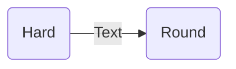

## **1. Database Management System (DBMS)**

### **1.1 Introduction to data, database, Database system, DBMS**

A computer is an electronic device, operating under the control of instructions stored in its own memory that can accept data (input), process the data according to specified rules, produce information (output), and store the information for future use.  
The physical parts that make up a computer (the central processing unit, input, output, and memory) are called hardware. Programs that tell a computer what to do are called software. A set of instructions that perform a particular task is called a program, software program, or software. Peripherals are any hardware device connected to a computer, any part of the computer outside the CPU and working memory. Some examples of peripherals are keyboards, the mouse, monitors, printers, scanners, disk and tape drives, microphones, speakers, joysticks, plotters, and cameras. Computer is an advanced electronic device that takes raw data as input from the user and processes these data under the control of set of instructions (called program) and gives the result (output) and saves output for the future use. It can process both numerical and non-numerical (arithmetic and logical) calculations.

### **1.2 Introduction to data, database, Database system, DBMS**

### **1.3 Advantages of using DBMS**

### **1.4 DDL (Data Definition Language) and DML (Data Manipulation Language)**

### **1.5 Database Model: Network Model, Hierarchical Model, Relational database model**

### **1.6 Concept of Normalization: 1NF, 2NF, 3NF**

### **1.7 Centralized Vs. Distributed Database**

### **1.8 Database Security**

## **2. Data Communication and Networking**

### **2.1 Basic elements of Communication System:**

Communication is the act of transmission of information. Every living creature within the world experiences the necessity to impart or receive information, virtually unceasingly, with alternatives in the closed world. For communication to be successful, it’s essential that the sender and the receiver perceive a standard language.
Humans have perpetually created endeavors to enhance the standard of communication with other human beings. Languages and the ways utilized in communication have been unbroken, evolving from prehistoric to fashionable times, to fulfil the growing demands in terms of speed and quality of information.  

Communication System that relies on the electronics means is known as Electronic Communication Systems and similarly Digital Communication System if the electronics are digital which are mostly used these days.  

> ***The basic components of a communication system are***  
>
i. Information Source  
ii. Transmitter  
iii. Communication Channel  
iv. Receiver  
v. Destination  
{: .prompt-tip}

***Information Source:***  

We know that communication systems are the art of information exchange. Therefore, to establish communication we need some type of information. This information originates from the information source.  
> The information generated by the source may be in the form of sound (human speech), picture (image source), words etc.
{: .prompt-tip}

***Transmitter:***  

The transmitter is a device which converts the signal produced by the source into a form that is suitable for transmission over a given channel or medium. Transmitters use a technique called modulation to convert the electrical signal into a form that is suitable for transmission over a given channel or medium.  

When we send the signal over larger distances, it undergoes various circumstances which makes the signal weak. To send the signals over larger distances, without the effect of any external interferences or noise addition and without getting faded away, it must undergo a process called modulation. Modulation increases the strength of a signal without changing the parameters of the original signal. Thus, the resulting signal overcomes the various effects which make it become weak.  

***Communication Channel:***

The communication channel is a medium through which the signal travels.  

>***Communication channels are divided into two categories:***
>
>i. Guided Channel  
>ii. Unguided Channel
>
>If the channel does not allow the signal following through the medium to escape out of medium, then it is said to be Guided Medium or channel otherwise it is Unguided Channel or Medium. For example, wired communication systems use guided medium as wire and wireless communications systems use unguided medium as open space.
{: .prompt-tip}

***Receiver:***

The receiver is a device that receives the signal from the channel and converts the signal back to its original form (light and sound) which is understandable by humans at the destination.  

***Destination:***

The destination is the final stage in the communication system. Generally, humans at some places are considered as the destination. A destination is a place where this information is supposed to be consumed.

### **2.2 Concept of Communication System**

The word Communication (derived from the Latin ‘Communicare’ it means ‘to share’) is the act of sharing ideas, emotions, and feelings between two or more people.  

We are aware of the need for and importance of communication as it is a general phenomenon. Nowadays communication is playing a vital role in every step of an individual. Wherever life exists, communication also exists.

The history of communication itself can be traced back since the origin of speech. The use of technology in communication may be considered since the first use of symbols about 30,000 years BCE. Among the symbols used, there are cave paintings, petroglyphs, pictograms and ideograms. Writing was a major innovation, as well as printing technology and, more recently, telecommunications and the Internet.

The history of telecommunication - the transmission of signals over a distance for the purpose of communication - began thousands of years ago with the use of smoke signals and drums in Africa, America and parts of Asia. In the 1790s the first fixed semaphore systems emerged in Europe however it was not until the 1830s that electrical telecommunication systems started to appear.

### **2.3 Block Diagram of communication System /Model**

### **2.4 Elements of Data Communication/Transmission**

### **2.5 Simplex, Half duplex and Full duplex communication mode**

### **2.6 Concept of LAN and WAN**

### **2.7 Transmission Medium: Guided and Unguided**

### **2.8 Transmission impairments terminology (Jitter, Singing, Echo, Crosstalk, Distortion, Noise, Bandwidth, Number of receivers)**

### **2.9 Basic concept of Networks Architecture: Client-Server and Peer-to-peer**

### **2.10 Some Basic Terms and Tool Used in Computer Network: IP Address, Sub Net Mask and Gateway, MAC address, Internet, Intranet, Extranet**

### **2.11 Network Tool: Packet tracer, Remote Login**

### **2.12 Network Connecting Devices: NIC, Modem, router, switch**

### **2.13 Network Topologies: Bus, Ring and star topology**

### **2.14 Basic Concept OSI Reference Model**

### **2.15 Internet Protocol Addressing**

## **3. Web Technology II**

### **3.1 Introduction**

A computer is an electronic device, operating under the control of instructions stored in its own memory that can accept data (input), process the data according to specified rules, produce information (output), and store the information for future use.  
The physical parts that make up a computer (the central processing unit, input, output, and memory) are called hardware. Programs that tell a computer what to do are called software. A set of instructions that perform a particular task is called a program, software program, or software. Peripherals are any hardware device connected to a computer, any part of the computer outside the CPU and working memory. Some examples of peripherals are keyboards, the mouse, monitors, printers, scanners, disk and tape drives, microphones, speakers, joysticks, plotters, and cameras. Computer is an advanced electronic device that takes raw data as input from the user and processes these data under the control of set of instructions (called program) and gives the result (output) and saves output for the future use. It can process both numerical and non-numerical (arithmetic and logical) calculations.

### **3.2 Server side and Client Side Scripting**

### **3.3 Introduction of internet technology**

### **3.4 Adding Java script to HTML page**

### **3.5 Java script fundamental**

### **3.6 Java Script Data types**

### **3.7 Variables and operators**

### **3.8 Functions and control structure if-else, if-elseif, switch-case, for, while, do while loop**

### **3.9 Object based programming with Java Script and Event handling**

### **3.10 Image, event and form objects**

### **3.11 Form validation, JQuery**

### **3.12 Server Side Scripting using PHP**

### **3.13 Introduction to PHP: Hardware and Software Requirements**

### **3.14 Object oriented programming with server side scripting**

### **3.15 Basic PHP syntax**

### **3.16 PHP data types**

### **3.17 Basic Programming in PHP**

### **3.18 Operators (Arithmetic, logical, comparison, operator precedence)**

### **3.19 Variables Manipulation**

### **3.20 Database Connectivity**

### **3.21 Connecting server side script to database**

### **3.22 Making SQL queries**

### **3.23 Fetching data sets getting data about data**

### **3.24 Creating SQL database with server side scripting**

## **4. Programming in C**

### **4.1 Review of C programming concept**

A computer is an electronic device, operating under the control of instructions stored in its own memory that can accept data (input), process the data according to specified rules, produce information (output), and store the information for future use.  
The physical parts that make up a computer (the central processing unit, input, output, and memory) are called hardware. Programs that tell a computer what to do are called software. A set of instructions that perform a particular task is called a program, software program, or software. Peripherals are any hardware device connected to a computer, any part of the computer outside the CPU and working memory. Some examples of peripherals are keyboards, the mouse, monitors, printers, scanners, disk and tape drives, microphones, speakers, joysticks, plotters, and cameras. Computer is an advanced electronic device that takes raw data as input from the user and processes these data under the control of set of instructions (called program) and gives the result (output) and saves output for the future use. It can process both numerical and non-numerical (arithmetic and logical) calculations.

### **4.2 Functions**

### **4.2.1 Concept of library and user defined functions and advantages**

### **4.2.2 Function definition, Prototype, call and return statements**

### **4.2.3 Accessing a Function by passing values**

### **4.2.4 Concept of storage: automatic and external**

### **4.2.5 Concept of Recursion: factorial and Fibonacci problems**

### **4.3 Structures and Unions**

### **4.3.1 Structure: Definition, Declaration, Initialization and Size of Structure**

### **4.3.2 Accessing member of structure**

### **4.3.3 Array of structure**

### **4.3.4 Union: Definition, Declaration**

### **4.3.5 Difference between union and structure**

### **4.4 Pointers**

### **4.4.1 Definition of Pointer**

### **4.4.2 Address (&) and indirection (*) operator**

### **4.4.3 Pointer Expression and Assignment**

### **4.4.4 Call by values and call by reference**

### **4.5 Working with Files**

### **4.5.1 Concept of Data File**

### **4.5.2 Sequential and Random File**

### **4.5.3 File manipulation function: putw, getw, putc, getc, fscanf, fprintf**

### **4.5.4 Opening, Reading, Writing and Appending data file**

## **5. Object-Oriented Programming (OOP)**

### **5.1 Programming paradigms: procedural, structural and object oriented**

A computer is an electronic device, operating under the control of instructions stored in its own memory that can accept data (input), process the data according to specified rules, produce information (output), and store the information for future use.  
The physical parts that make up a computer (the central processing unit, input, output, and memory) are called hardware. Programs that tell a computer what to do are called software. A set of instructions that perform a particular task is called a program, software program, or software. Peripherals are any hardware device connected to a computer, any part of the computer outside the CPU and working memory. Some examples of peripherals are keyboards, the mouse, monitors, printers, scanners, disk and tape drives, microphones, speakers, joysticks, plotters, and cameras. Computer is an advanced electronic device that takes raw data as input from the user and processes these data under the control of set of instructions (called program) and gives the result (output) and saves output for the future use. It can process both numerical and non-numerical (arithmetic and logical) calculations.

### **5.2 Features of OOP: Class, Object, Polymorphism and Inheritance**

A computer is an electronic device, operating under the control of instructions stored in its own memory that can accept data (input), process the data according to specified rules, produce information (output), and store the information for future use.  

### **5.3 Advantages of OOP**

A computer is an electronic device, operating under the control of instructions stored in its own memory that can accept data (input), process the data according to specified rules, produce information (output), and store the information for future use.  

### **5.4 Application of OOP**

A computer is an electronic device, operating under the control of instructions stored in its own memory that can accept data (input), process the data according to specified rules, produce information (output), and store the information for future use.

## **6. Software Process Model (SPM)**

### **6.1 Software Project Concept**

A computer is an electronic device, operating under the control of instructions stored in its own memory that can accept data (input), process the data according to specified rules, produce information (output), and store the information for future use.  
The physical parts that make up a computer (the central processing unit, input, output, and memory) are called hardware. Programs that tell a computer what to do are called software. A set of instructions that perform a particular task is called a program, software program, or software. Peripherals are any hardware device connected to a computer, any part of the computer outside the CPU and working memory. Some examples of peripherals are keyboards, the mouse, monitors, printers, scanners, disk and tape drives, microphones, speakers, joysticks, plotters, and cameras. Computer is an advanced electronic device that takes raw data as input from the user and processes these data under the control of set of instructions (called program) and gives the result (output) and saves output for the future use. It can process both numerical and non-numerical (arithmetic and logical) calculations.

### **6.2 Concept of software development process**

A computer is an electronic device, operating under the control of instructions stored in its own memory that can accept data (input), process the data according to specified rules, produce information (output), and store the information for future use.  

### **6.3 Concept SDLC life cycle**

A computer is an electronic device, operating under the control of instructions stored in its own memory that can accept data (input), process the data according to specified rules, produce information (output), and store the information for future use.  

### **6.4 System Analyst Vs Software Engineer**

A computer is an electronic device, operating under the control of instructions stored in its own memory that can accept data (input), process the data according to specified rules, produce information (output), and store the information for future use.

### **6.5 Requirement Collection Methods**

A computer is an electronic device, operating under the control of instructions stored in its own memory that can accept data (input), process the data according to specified rules, produce information (output), and store the information for future use.

### **6.6 Concept of system design**

A computer is an electronic device, operating under the control of instructions stored in its own memory that can accept data (input), process the data according to specified rules, produce information (output), and store the information for future use.

### **6.7 Software and quality**

A computer is an electronic device, operating under the control of instructions stored in its own memory that can accept data (input), process the data according to specified rules, produce information (output), and store the information for future use.

### **6.8 Software development model: waterfall, prototype, agile**

A computer is an electronic device, operating under the control of instructions stored in its own memory that can accept data (input), process the data according to specified rules, produce information (output), and store the information for future use.

## **7. Recent Trends in Technology**

### **7.1 Concept of Artificial Intelligence (AI) and Robotics**

A computer is an electronic device, operating under the control of instructions stored in its own memory that can accept data (input), process the data according to specified rules, produce information (output), and store the information for future use.  
The physical parts that make up a computer (the central processing unit, input, output, and memory) are called hardware. Programs that tell a computer what to do are called software. A set of instructions that perform a particular task is called a program, software program, or software. Peripherals are any hardware device connected to a computer, any part of the computer outside the CPU and working memory. Some examples of peripherals are keyboards, the mouse, monitors, printers, scanners, disk and tape drives, microphones, speakers, joysticks, plotters, and cameras. Computer is an advanced electronic device that takes raw data as input from the user and processes these data under the control of set of instructions (called program) and gives the result (output) and saves output for the future use. It can process both numerical and non-numerical (arithmetic and logical) calculations.

### **7.2 Concept of Cloud Computing**

A computer is an electronic device, operating under the control of instructions stored in its own memory that can accept data (input), process the data according to specified rules, produce information (output), and store the information for future use.  

### **7.3 Concept of Big Data**

A computer is an electronic device, operating under the control of instructions stored in its own memory that can accept data (input), process the data according to specified rules, produce information (output), and store the information for future use.  

### **7.4 Concept of Virtual Reality**

A computer is an electronic device, operating under the control of instructions stored in its own memory that can accept data (input), process the data according to specified rules, produce information (output), and store the information for future use.

### **7.5 Concept of e-com, e-medicine, e-gov**

A computer is an electronic device, operating under the control of instructions stored in its own memory that can accept data (input), process the data according to specified rules, produce information (output), and store the information for future use.

### **7.6 Concept of Mobile Computing**

A computer is an electronic device, operating under the control of instructions stored in its own memory that can accept data (input), process the data according to specified rules, produce information (output), and store the information for future use.

### **7.7 Concept of Internet of things (IoT)**

A computer is an electronic device, operating under the control of instructions stored in its own memory that can accept data (input), process the data according to specified rules, produce information (output), and store the information for future use.
