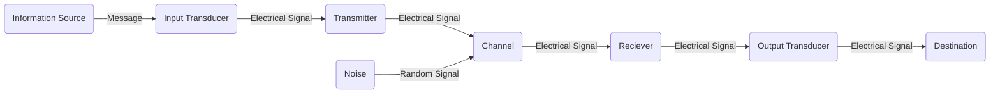

## **2. Data Communication and Networking**

### **2.1 Basic elements of Communication System:**

Communication is the act of transmission of information. Every living creature within the world experiences the necessity to impart or receive information, virtually unceasingly, with alternatives in the closed world. For communication to be successful, it’s essential that the sender and the receiver perceive a standard language.
Humans have perpetually created endeavors to enhance the standard of communication with other human beings. Languages and the ways utilized in communication have been unbroken, evolving from prehistoric to fashionable times, to fulfil the growing demands in terms of speed and quality of information.  

Communication System that relies on the electronics means is known as Electronic Communication Systems and similarly Digital Communication System if the electronics are digital which are mostly used these days.  

> ***The basic components of a communication system are***  
>
i. Information Source  
ii. Transmitter  
iii. Communication Channel  
iv. Receiver  
v. Destination  
{: .prompt-tip}

***Information Source:***  

We know that communication systems are the art of information exchange. Therefore, to establish communication we need some type of information. This information originates from the information source.  
> The information generated by the source may be in the form of sound (human speech), picture (image source), words etc.
{: .prompt-tip}

***Transmitter:***  

The transmitter is a device which converts the signal produced by the source into a form that is suitable for transmission over a given channel or medium. Transmitters use a technique called modulation to convert the electrical signal into a form that is suitable for transmission over a given channel or medium.  

When we send the signal over larger distances, it undergoes various circumstances which makes the signal weak. To send the signals over larger distances, without the effect of any external interferences or noise addition and without getting faded away, it must undergo a process called modulation. Modulation increases the strength of a signal without changing the parameters of the original signal. Thus, the resulting signal overcomes the various effects which make it become weak.  

***Communication Channel:***

The communication channel is a medium through which the signal travels.  

>***Communication channels are divided into two categories:***
>
>i. Guided Channel  
>ii. Unguided Channel
>
>If the channel does not allow the signal following through the medium to escape out of medium, then it is said to be Guided Medium or channel otherwise it is Unguided Channel or Medium. For example, wired communication systems use guided medium as wire and wireless communications systems use unguided medium as open space.
{: .prompt-tip}

***Receiver:***

The receiver is a device that receives the signal from the channel and converts the signal back to its original form (light and sound) which is understandable by humans at the destination.  

***Destination:***

The destination is the final stage in the communication system. Generally, humans at some places are considered as the destination. A destination is a place where this information is supposed to be consumed.

### **2.2 Concept of Communication System**

The word Communication (derived from the Latin ‘Communicare’ it means ‘to share’) is the act of sharing ideas, emotions, and feelings between two or more people.  

We are aware of the need for and importance of communication as it is a general phenomenon. Nowadays communication is playing a vital role in every step of an individual. Wherever life exists, communication also exists.

The history of communication itself can be traced back since the origin of speech. The use of technology in communication may be considered since the first use of symbols about 30,000 years BCE. Among the symbols used, there are cave paintings, petroglyphs, pictograms and ideograms. Writing was a major innovation, as well as printing technology and, more recently, telecommunications and the Internet.

The history of telecommunication - the transmission of signals over a distance for the purpose of communication - began thousands of years ago with the use of smoke signals and drums in Africa, America and parts of Asia. In the 1790s the first fixed semaphore systems emerged in Europe however it was not until the 1830s that electrical telecommunication systems started to appear.

### **2.3 Block Diagram of communication System /Model**

### **2.4 Elements of Data Communication/Transmission**

[Refer to 2.1](/posts/Theory_12_Notes/#21-basic-elements-of-communication-system)

### **2.5 Simplex, Half duplex and Full duplex communication mode**

Data communication happens in the form of signals between two or more computing devices or nodes. The transfer  of  data  happens over a point-to-point  or multipoint communication channel. Data communication between different devices are broadly categorised into 3 types: Simplex communication, Halfduplex communication, and Full-duplex communication.

***Simplex Communication System***

In Simplex mode, the communication is unidirectional, as on a one-way street. Only one of the two devices on a link can transmit, the other can only receive. The simplex mode can use the entire capacity of the channel to send data in one direction.
Example: Keyboard and traditional monitors. The keyboard can only introduce input, the monitor can only give the output.

***Half Duplex Communication System***

In half-duplex mode, each station can both transmit and receive, but not at the same time. While one device is sending, the other can only receive, and vice versa. The half-duplex mode is used in cases where there is no need for communication in both directions at the same time. The entire capacity of the channel can be utilized for each direction.
Example: Walkie-talkie in which message is sent one at a time and messages are sent in both directions.

>Channel capacity = Bandwidth * Propagation Delay
{: .prompt-tip}

### **2.6 Concept of LAN and WAN**

***LAN***  

A local area network (LAN) is a network confined to a small, localized area. Home WiFi networks and small business networks are common examples of LANs. Typically, whoever manages the LAN also manages the networking equipment it uses. A small business, for instance, will manage the routers and switches involved in setting up the LAN.  

***WAN***  

A wide area network (WAN) is a large computer network that connects groups of computers over large distances. WANs are often used by large businesses to connect their office networks; each office typically has its own local area network, or LAN, and these LANs connect via a WAN. These long connections may be formed in several different ways, including leased lines, VPNs, or IP tunnels.  
A wide area network (WAN) is a large computer network that connects groups of computers over large distances. WANs are often used by large businesses to connect their office networks; each office typically has its own local area network, or LAN, and these LANs connect via a WAN. These long connections may be formed in several different ways, including leased lines, VPNs, or IP tunnels.  

### **2.7 Transmission Medium: Guided and Unguided**

A transmission medium is a system or substance that can mediate the propagation of signals for the purposes of telecommunication. Signals are typically imposed on a wave of some kind suitable for the chosen medium. For example, data can modulate sound, and a transmission medium for sounds may be air, but solids and liquids may also act as the transmission medium. Vacuum or air constitutes a good transmission medium for electromagnetic waves such as light and radio waves. While material substance is not required for electromagnetic waves to propagate, such waves are usually affected by the transmission media they pass through, for instance, by absorption or reflection or refraction at the interfaces between media. Technical devices can therefore be employed to transmit or guide waves. Thus, an optical fiber or a copper cable is used as transmission media.  

>For any networking to be effective, raw stream of data is to be transported from one device to other over some medium. Various transmission media can be used for transfer of data. These transmission media may be of two types −
>
>***Guided Medium***  
>
>In guided media, transmitted data travels through cabling system that has a fixed path. For example, copper wires, fibre optic wires, etc.
>
>***Unguided Medium***  
>
>In unguided media, transmitted data travels through free space in form of electromagnetic signal. For example, radio waves, lasers, etc.
{: .prompt-tip}

### **2.8 Transmission impairments terminology**

In the data communication system, analog and digital signals go through the transmission medium. Transmission media are not ideal. There are some imperfections in transmission mediums. So, the signals sent through the transmission medium are also not perfect. This imperfection cause **signal impairment**.

It means that signals that are transmitted at the beginning of the medium are not the same as the signals that are received at the end of the medium that is what is sent is not what is received. These impairments tend to deteriorate the quality of analog and digital signals.  

### Causes of impairment

***Jitter***

 Jitter is the deviation from true periodicity of a presumably periodic signal, often in relation to a reference clock signal. In clock recovery applications it is called timing jitter. Jitter is a significant, and usually undesired, factor in the design of almost all communications links.

 Jitter can be quantified in the same terms as all time-varying signals, e.g., root mean square (RMS), or peak-to-peak displacement. Also, like other time-varying signals, jitter can be expressed in terms of spectral density.

 Jitter may be caused by electromagnetic interference and crosstalk with carriers of other signals. Jitter can cause a display monitor to flicker, affect the performance of processors in personal computers, introduce clicks or other undesired effects in audio signals, and cause loss of transmitted data between network devices. The amount of tolerable jitter depends on the affected application.

***Echo***

As the name implies, echo in communication systems is the return of a talker's voice. It is most apparent to the talker himself or herself. Secondarily, it can also be an annoyance to the listener. To be an impairment, the returned voice must suffer some noticeable delay. Thus we can say that echo is a reflection of the voice. The cause of echo is impedance mismatches that might be present any place in the electrical communication connection. Echo is a major annoyance to the communication user. It affects the talker more than the listener. Two factors determine the degree of annoyance of echo: its loudness and its length of delay.

***Singing***

Singing is the result of sustained oscillations due to positive feedback in communication amplifiers or amplifying circuits. Circuits that sing are unusable and promptly overload multiplex equipment, particularly FDM equipment.

Singing may be regarded as echo that is completely out of control. This can occur at the frequency at which the circuit is resonant. Under such conditions the circuit losses at the singing frequency are so low that oscillation will continue, even after cessation of its original pulse.

***Crosstalk***

In electronics, crosstalk is any phenomenon by which a signal transmitted on one circuit or channel of a transmission system creates an undesired effect in another circuit or channel. Crosstalk is usually caused by undesired capacitive, inductive, or conductive coupling from one circuit or channel to another.

Crosstalk is a significant issue in structured cabling, audio electronics, integrated circuit design, wireless communication and other communications systems.

***Distortion***

Distortion means that the signal changes its form or shape. Distortion can occur in a composite signal made of different frequencies. Each signal component has its own propagation speed (see the next section) through a medium and, therefore, its own delay in arriving at the final destination. Differences in delay may create a difference in phase if the delay is not exactly the same as the period duration. In other words, signal components at the receiver have phases different from what they had at the sender. The shape of the composite signal is therefore not the same. Figure below shows the effect of distortion on a composite signal.  

***Noise***

Noise is another cause of impairment. Several types of noise, such as thermal noise, induced noise, crosstalk, and impulse noise, may corrupt the signal. Thermal noise is the random motion of electrons in a wire which creates an extra signal not originally sent by the transmitter. Induced noise comes from sources such as motors and appliances. These devices act as a sending antenna, and the transmission medium acts as the receiving antenna. Crosstalk is the effect of one wire on the other. One wire acts as a sending antenna and the other as the receiving antenna. Impulse noise is a spike (a sig- nal with high energy in a very short time) that comes from power lines, lightning, and so on. Figure below shows the effect of noise on a signal.  

***Bandwidth***

It is the maximum amount of data transmitted over an internet connection in a given amount of time. Bandwidth is often mistaken for internet speed when it's actually the volume of information that can be sent over a connection in a measured amount of time calculated in megabits per second (Mbps).  

Bandwidth is how much information you receive every second, while speed is how fast that information is received or downloaded. Let's compare it to filling a bathtub. If the bathtub faucet has a wide opening, more water can flow at a faster rate than if the pipe was narrower. Think of the water as the bandwidth and the rate at which the water flows as the speed.

***Number of receivers***

Number of devices or reciever connected to the communication system consumes some amount of power from the signal comming from the channel. Hence connecting recievers of devices to the network directly effect the performance and efficiency of the communication system. To omit these kinds of power issue we can use the power boosters or power injection technique. Although in digital network the more no of clients or reciver connected to the router or network devices may result in network congestion which may result in slower network and less efficient network.

### **2.9 Basic concept of Networks Architecture: Client-Server and Peer-to-peer**

Network architecture refers to the way network devices and nodes are structured or interconnected to serve the connectivity needs or accomplish the goal. Computer Network Architecture is defined as the physical and logical design of the software, hardware, protocols, and media of the transmission of data. Simply we can say that how computers are organized and how tasks are allocated to the computer.

***Client-Server***

Client-server architecture, architecture of a computer network in which many clients (remote processors) request and receive service from a centralized server (host computer). In a client/server network, a centralized, powerful computer(server) act as a hub in which other computers or workstations(clients) can connect to. This server is the heart of the system, which manages and provides resources to any client that requests them.

***Peer-to-peer***

In a peer-to-peer network are allocated to every device on the network. Furthermore, there is no real hierarchy in this network, all computers are considered equal, and all have the same abilities to use the resources available on this network. Instead of having a central server which would act as the shared drive, each computer that's connected to this network would act as the server for the files stored on it.

The IP address space is managed globally by the Internet Assigned Numbers Authority (IANA), and by five regional Internet registries (RIRs) responsible in their designated territories for assignment to local Internet registries, such as Internet service providers (ISPs), and other end users. IPv4 addresses were distributed by IANA to the RIRs in blocks of approximately 16.8 million addresses each, but have been exhausted at the IANA level since 2011. Only one of the RIRs still has a supply for local assignments in Africa. Some IPv4 addresses are reserved for private networks and are not globally unique.

### **2.10 Some Basic Terms and Tool Used in Computer Network:**

***IP Address***

An Internet Protocol address (IP address) is a numerical label such as `192.0.2.1` that is connected to a computer network that uses the Internet Protocol for communication. An IP address serves two main functions: network interface identification and location addressing. Internet Protocol version 4 (IPv4) defines an IP address as a `32-bit` number. However, because of the growth of the Internet and the depletion of available IPv4 addresses, a new version of IP (IPv6), using `128 bits` for the IP address, was standardized in 1998. IPv6 deployment has been ongoing since the mid-2000s.

***Sub Net Mask and Gateway***

A subnetwork or subnet is a logical subdivision of an IP network.  The practice of dividing a network into two or more networks is called subnetting. Computers that belong to the same subnet are addressed with an identical most-significant bit-group in their IP addresses. This results in the logical division of an IP address into two fields: the network number or routing prefix and the rest field or host identifier. The rest field is an identifier for a specific host or network interface.  

For IPv4, a network may also be characterized by its subnet mask or netmask, which is the bitmask that, when applied by a bitwise AND operation to any IP address in the network, yields the routing prefix. Subnet masks are also expressed in dot-decimal notation like an IP address. For example, the prefix `198.51.100.0/24` would have the subnet mask `255.255.255.0`.

A network gateway is a device or node that connects disparate networks by translating communications from one protocol to another. A gateway connects networks, while a router typically delivers data within a network. Historically, gateways and routers have been separate devices. However, it's becoming more common for their functions to be combined and simply called a router. For example, the Wi-Fi routers commonly provided for home and small business internet service are both a router (delivering data) and a gateway (translating it so destination devices can use it).

A physical network gateway includes network interface cards (NICs) and inputs and outputs—usually Ethernet—and software for translating network protocols. Gateway functions may also be defined, deployed, and controlled through software, and are increasingly being built into routers and other equipment.

***MAC Address***

A MAC (Media Access Control) address, sometimes referred to as a hardware or physical address, is a unique, 12-character alphanumeric attribute that is used to identify individual electronic devices on a network. An example of a MAC address is: 0A-B0-D0-6F-C5-28. It is also known as “hardware address” or “physical address”, is a binary number used to uniquely identify computer network adapters. Packets that are sent on the Ethernet are always coming from a MAC address and sent to a MAC address. If a network adapter is receiving a packet, it is comparing the packet’s destination MAC address to the adapter’s own MAC address. If the addresses match, the packet is processed, otherwise it is discarded. Traditional MAC addresses are 12-digit hexadecimal numbers. The leftmost six hexadecimal digits of the address correspond to a manufacturer's unique identifier, while the rightmost six digits correspond to the serial number of the network interface card (NIC).

***Internet***

The Internet (or internet) is the global system of interconnected computer networks that uses the Internet protocol suite (TCP/IP) to communicate between networks and devices. It is a network of networks that consists of private, public, academic, business, and government networks of local to global scope, linked by a broad array of electronic, wireless, and optical networking technologies. The Internet carries a vast range of information resources and services, such as the inter-linked hypertext documents and applications of the World Wide Web (WWW), electronic mail, telephony, and file sharing.

The origins of the Internet date back to the development of packet switching and research commissioned by the United States Department of Defense in the 1960s to enable time-sharing of computers. The primary precursor network, the ARPANET, initially served as a backbone for interconnection of regional academic and military networks in the 1970s. Most traditional communication media, including telephone, radio, television, paper mail and newspapers are reshaped, redefined, or even bypassed by the Internet, giving birth to new services such as email, Internet telephone, Internet television, online music, digital newspapers, and video streaming websites. Newspaper, book, and other print publishing are adapting to website technology, or are reshaped into blogging, web feeds and online news aggregators. The Internet has enabled and accelerated new forms of personal interactions through instant messaging, Internet forums, and social networking services. Online shopping has grown exponentially for major retailers, small businesses, and entrepreneurs, as it enables firms to extend their "brick and mortar" presence to serve a larger market or even sell goods and services entirely online. Business-to-business and financial services on the Internet affect supply chains across entire industries.

***Intranet***

An intranet is a computer network for sharing information, easier communication, collaboration tools, operational systems, and other computing services within an organization, usually to the exclusion of access by outsiders. The term is used in contrast to public networks, such as the Internet, but uses the same technology based on the Internet protocol suite.

An organization-wide intranet can constitute an important focal point of internal communication and collaboration, and provide a single starting point to access internal and external resources. In its simplest form, an intranet is established with the technologies for local area networks (LANs) and wide area networks (WANs).

An intranet is sometimes contrasted to an extranet.

***Extranet***

An extranet is a controlled private network that allows access to partners, vendors and suppliers or an authorized set of customers – normally to a subset of the information accessible from an organization's intranet. An extranet is similar to a DMZ in that it provides access to needed services for authorized parties, without granting access to an organization's entire network.

Historically, the term was occasionally also used in the sense of two organizations sharing their internal networks over a virtual private network (VPN).

### **2.11 Network Tool:**

***Packet tracer***

Packet Tracer is a cross-platform visual simulation tool designed by Cisco Systems that allows users to create network topologies and imitate modern computer networks. The software allows users to simulate the configuration of Cisco routers and switches using a simulated command line interface. Packet Tracer makes use of a drag and drop user interface, allowing users to add and remove simulated network devices as they see fit. The software is mainly focused towards Cisco Networking Academy students as an educational tool for helping them learn fundamental CCNA concepts. Previously students enrolled in a CCNA Academy program could freely download and use the tool free of charge for educational use.

***Remote Login***

Remote Login is a process in which user can login into remote site i.e. computer and use services that are available on the remote computer. With the help of remote login a user is able to understand result of transferring result of processing from the remote computer to the local computer.

### **2.12 Network Connecting Devices: NIC, Modem, router, switch**

***NIC (Network Interface Controller)***

A network interface controller (NIC, also known as a network interface card, network adapter, LAN adapter or physical network interface, and by similar terms) is a computer hardware component that connects a computer to a computer network. Early network interface controllers were commonly implemented on expansion cards that plugged into a computer bus. The low cost and ubiquity of the Ethernet standard means that most newer computers have a network interface built into the motherboard, or is contained into a USB-connected dongle.

The network controller implements the electronic circuitry required to communicate using a specific physical layer and data link layer standard such as Ethernet or Wi-Fi. This provides a base for a full network protocol stack, allowing communication among computers on the same local area network (LAN) and large-scale network communications through routable protocols, such as Internet Protocol (IP).

***Modem (Modulator and Demodulator)***

A modulator-demodulator or modem is a computer hardware device that converts data from a digital format into a format suitable for an analog transmission medium such as telephone or radio. A modem transmits data by modulating one or more carrier wave signals to encode digital information, while the receiver demodulates the signal to recreate the original digital information. The goal is to produce a signal that can be transmitted easily and decoded reliably. Modems can be used with almost any means of transmitting analog signals, from light-emitting diodes to radio.

### **2.13 Network Topologies: ,  and  topology**

Network Topology is the arrangement with which computer systems or network devices are connected to each other. Topologies may define both physical and logical aspect of the network. Both logical and physical topologies could be the same or different in a same network.

***Bus Topology***

In case of Bus topology, all devices share single communication line or cable. Bus topology may have problem while multiple hosts sending data at the same time. Therefore, Bus topology either uses CSMA/CD technology or recognizes one host as Bus Master to solve the issue. It is one of the simple forms of networking where a failure of a device does not affect the other devices. But failure of the shared communication line can make all other devices stop functioning. Both ends of the shared channel have line terminator. The data is sent in only one direction and as soon as it reaches the extreme end, the terminator removes the data from the line.

***Ring Topology***

In ring topology, each host machine connects to exactly two other machines, creating a circular network structure. When one host tries to communicate or send message to a host which is not adjacent to it, the data travels through all intermediate hosts. To connect one more host in the existing structure, the administrator may need only one more extra cable.

Failure of any host results in failure of the whole ring. Thus, every connection in the ring is a point of failure. There are methods which employ one more backup ring.

***Star Topology***

All hosts in Star topology are connected to a central device, known as hub device, using a point-to-point connection. That is, there exists a point-to-point connection between hosts and hub. The hub device can be any of the following:

* Layer-1 device such as hub or repeater
* Layer-2 device such as switch or bridge
* Layer-3 device such as router or gateway

As in Bus topology, hub acts as single point of failure. If hub fails, connectivity of all hosts to all other hosts fails. Every communication between hosts, takes place through only the hub. Star topology is not expensive as to connect one more host, only one cable is required, and configuration is simple.

***Mesh Topology***

In this type of topology, a host is connected to one or multiple hosts. This topology has hosts in point-to-point connection with every other host or may also have hosts which are in point-to-point connection to few hosts only.

Hosts in Mesh topology also work as relay for other hosts which do not have direct point-to-point links. Mesh technology comes into two types:

* Full Mesh: All hosts have a point-to-point connection to every other host in the network. Thus, for every new host n(n-1)/2 connections are required. It provides the most reliable network structure among all network topologies.
* Partially Mesh: Not all hosts have point-to-point connection to every other host. Hosts connect to each other in some arbitrarily fashion. This topology exists where we need to provide reliability to some hosts out of all.

### **2.14 Basic Concept OSI Reference Model**

OSI stands for Open Systems Interconnection. It has been developed by ISO – ‘International Organization for Standardization‘, in the year 1984. It is a 7 layer architecture with each layer having specific functionality to perform. All these 7 layers work collaboratively to transmit the data from one person to another across the globe.

1. Physical Layer (Layer 1) :  
The lowest layer of the OSI reference model is the physical layer. It is responsible for the actual physical connection between the devices. The physical layer contains information in the form of bits. It is responsible for transmitting individual bits from one node to the next. When receiving data, this layer will get the signal received and convert it into 0s and 1s and send them to the Data Link layer, which will put the frame back together.  

   

   >The functions of the physical layer are as follows:  
   >
   > * Bit synchronization: The physical layer provides the synchronization of the bits by providing a clock. This clock controls both sender and receiver thus providing synchronization at bit level.
   > * Bit rate control: The Physical layer also defines the transmission rate i.e. the number of bits sent per second.
   > * Physical topologies: Physical layer specifies the way in which the different, devices/nodes are arranged in a network i.e. bus, star, or mesh topology.
   > * Transmission mode: Physical layer also defines the way in which the data flows between the two connected devices. The various transmission modes possible are Simplex, half-duplex and full-duplex.
   {: .prompt-tip}

2. Data Link Layer (DLL) (Layer 2) :  
The data link layer is responsible for the node-to-node delivery of the message. The main function of this layer is to make sure data transfer is error-free from one node to another, over the physical layer. When a packet arrives in a network, it is the responsibility of DLL to transmit it to the Host using its MAC address.

    >The functions of the Data Link layer are :  
    >
    > * Framing: Framing is a function of the data link layer. It provides a way for a sender to transmit a set of bits that are meaningful to the receiver. This can be accomplished by attaching special bit patterns to the beginning and end of the frame.
    > * Physical addressing: After creating frames, the Data link layer adds physical addresses (MAC address) of the sender and/or receiver in the header of each frame.
    > * Error control: Data link layer provides the mechanism of error control in which it detects and retransmits damaged or lost frames.
    > * Flow Control: The data rate must be constant on both sides else the data may get corrupted thus, flow control coordinates the amount of data that can be sent before receiving acknowledgement.
    > * Access control: When a single communication channel is shared by multiple devices, the MAC sub-layer of the data link layer helps to determine which device has control over the channel at a given time.
    {: .prompt-tip}

3. Network Layer (Layer 3) :  
The network layer works for the transmission of data from one host to the other located in different networks. It also takes care of packet routing i.e. selection of the shortest path to transmit the packet, from the number of routes available. The sender & receiver’s IP addresses are placed in the header by the network layer.  

   >The functions of the Network layer are :  
   >
   > * Routing: The network layer protocols determine which route is suitable from source to destination. This function of the network layer is known as routing.
   > * Logical Addressing: In order to identify each device on internetwork uniquely, the network layer defines an addressing scheme. The sender & receiver’s IP addresses are placed in the header by the network layer. Such an address distinguishes each device uniquely and universally.
   {: .prompt-tip}

4. Transport Layer (Layer 4) :  

   The transport layer provides services to the application layer and takes services from the network layer. The data in the transport layer is referred to as Segments. It is responsible for the End to End Delivery of the complete message. The transport layer also provides the acknowledgement of the successful data transmission and re-transmits the data if an error is found.

   At sender’s side: Transport layer receives the formatted data from the upper layers, performs Segmentation, and also implements Flow & Error control to ensure proper data transmission. It also adds Source and Destination port numbers in its header and forwards the segmented data to the Network Layer.  

   > Note: The sender needs to know the port number associated with the receiver’s application.  
   {: .prompt-tip}

   Generally, this destination port number is configured, either by default or manually. For example, when a web application makes a request to a web server, it typically uses port number 80, because this is the default port assigned to web applications. Many applications have default ports assigned.  

   At receiver’s side: Transport Layer reads the port number from its header and forwards the Data which it has received to the respective application. It also performs sequencing and reassembling of the segmented data.  

   >The functions of the transport layer are as follows:  
   >  
   > * Segmentation and Reassembly: This layer accepts the message from the (session) layer, and breaks the message into smaller units. Each of the segments produced has a header associated with it. The transport layer at the destination station reassembles the message.
   > * Service Point Addressing: In order to deliver the message to the correct process, the transport layer header includes a type of address called service point address or port address. Thus by specifying this address, the transport layer makes sure that the message is delivered to the correct process.
   {: .prompt-tip}

5. Session Layer (Layer 5) :  
   This layer is responsible for the establishment of connection, maintenance of sessions, authentication, and also ensures security.  

   >The functions of the session layer are :  
   >
   > * Session establishment, maintenance, and termination: The layer allows the two processes to establish, use and terminate a connection.
   > * Synchronization: This layer allows a process to add checkpoints which are considered synchronization points into the data. These synchronization points help to identify the error so that the data is re-synchronized properly, and ends of the messages are not cut prematurely and data loss is avoided.
   > * Dialog Controller: The session layer allows two systems to start communication with each other in half-duplex or full-duplex.
   {: .prompt-tip}

6. Presentation Layer (Layer 6):
The presentation layer is also called the Translation layer. The data from the application layer is extracted here and manipulated as per the required format to transmit over the network.  

   >The functions of the presentation layer are :  
   >
   > * Translation: For example, ASCII to EBCDIC.
   > * Encryption/ Decryption: Data encryption translates the data into another form or code. The encrypted data is known as the ciphertext and the decrypted data is known as plain text. A key value is used for encrypting as well as decrypting data.
   > * Compression: Reduces the number of bits that need to be transmitted on the network.
   {: .prompt-tip}

7. Application Layer (Layer 7) :
At the very top of the OSI Reference Model stack of layers, we find the Application layer which is implemented by the network applications. These applications produce the data, which has to be transferred over the network. This layer also serves as a window for the application services to access the network and for displaying the received information to the user.  

   >The functions of the Application layer are :  
   >
   > * Network Virtual Terminal
   > * FTAM-File transfer access and management
   > * Mail Services
   > * Directory Services
   {: .prompt-tip}

### **2.15 Internet Protocol Addressing**

IP address is an address having information about how to reach a specific host, especially outside the LAN. An IP address is a 32 bit unique address having an address space of $$2^{32}$$.  
Generally, there are two notations in which IP address is written, dotted decimal notation and hexadecimal notation.

Dotted Decimal Notation:

Some points to be noted about dotted decimal notation:

* The value of any segment (byte) is between 0 and 255 (both included).
* There are no zeroes preceding the value in any segment (054 is wrong, 54 is correct).

The 32 bit IP address is divided into five sub-classes. These are:

>Range of special IP addresses:
>
> * 169.254.0.0 – 169.254.0.16 : Link local addresses
> * 127.0.0.0 – 127.0.0.8 : Loop-back addresses
> * 0.0.0.0 – 0.0.0.8 : used to communicate within the current network.
{: .prompt-tip}

Each of these classes has a valid range of IP addresses. Classes D and E are reserved for multicast and experimental purposes respectively. The order of bits in the first octet determine the classes of IP address.

IPv4 address is divided into two parts:

* Network ID
* Host ID

The class of IP address is used to determine the bits used for network ID and host ID and the number of total networks and hosts possible in that particular class. Each ISP or network administrator assigns IP address to each device that is connected to its network.

>Note: IP addresses are globally managed by Internet Assigned Numbers Authority(IANA) and regional Internet registries(RIR).
>
>Note: While finding the total number of host IP addresses, 2 IP addresses are not counted and are therefore, decreased from the total count because the first IP address of any network is the network number and whereas the last IP address is reserved for broadcast IP.
{: .prompt-tip}

## **3. Web Technology II**

### **3.1 Introduction**

Web technologies refers to the way computers/devices communicate with each other using mark up languages. It invo It is communication across the web, and create, deliver or manage web content using hypertext markup language (HTML).  In the past few decades, web technology has undergone a dramatic transition, from a few marked up web pages to the ability to do very specific work on a network without interruption.

A web browser is used to access web pages. Web browsers can be defined as programs that display text, data, pictures, animation, and video on the Internet. Hyperlinked resources on the World Wide Web can be accessed using software interfaces provided by Web browsers.

> ***Few terms of web technology***
>
> * World Wide Web (WWW): The World Wide Web is based on several different technologies : Web browsers, Hypertext Markup Language (HTML) and Hypertext Transfer Protocol (HTTP).
>
> * Web Browser: The web browser is an application software to explore www (World Wide Web). It provides an interface between the server and the client and requests to the server for web documents and services.
>
> * Web Server: Web server is a program which processes the network requests of the users and serves them with files that create web pages. This exchange takes place using Hypertext Transfer Protocol (HTTP).
>
> * Web Pages: A webpage is a digital document that is linked to the World Wide Web and viewable by anyone connected to the internet has a web browser.
>
> * Web Development: Web development refers to the building, creating, and maintaining of websites. It includes aspects such as web design, web publishing, web programming, and database management. It is the creation of an application that works over the internet i.e. websites.
{: .prompt-tip}

### Web Development can be classified into two ways

* Frontend Development:  
  The part of a website that the user interacts directly is termed as front end. It is also referred to as the ‘client side’ of the application.
  
  

* Backend Development:  
  Backend is the server side of a website. It is the part of the website that users cannot see and interact. It is the portion of software that does not come in direct contact with the users. It is used to store and arrange data.

  

### **3.2 Server side and Client Side Scripting**

Server-side scripting is a technique used in web development which involves employing scripts on a web server which produces a response customized for each user's (client's) request to the website. The alternative is for the web server itself to deliver a static web page. Scripts can be written in any of a number of server-side scripting languages that are available (see below). Server-side scripting is distinguished from client-side scripting where embedded scripts, such as JavaScript, are run client-side in a web browser, but both techniques are often used together.

Server-side scripting is often used to provide a customized interface for the user. These scripts may assemble client characteristics for use in customizing the response based on those characteristics, the user's requirements, access rights, etc. Server-side scripting also enables the website owner to hide the source code that generates the interface, whereas, with client-side scripting, the user has access to all the code received by the client. A downside to the use of server-side scripting is that the client needs to make further requests over the network to the server in order to show new information to the user via the web browser. These requests can slow down the experience for the user, place more load on the server, and prevent the use of the application when the user is disconnected from the server.

Client side scripting is a process in which the code along with HTML web page is sent to the client by the server. Here, the code refers to the script.

In other simple words, client side scripting is a process in which scripts are executed by browsers without connecting the server.

The code executes on the browser of client’s computer either during the loading of web page or after the web page has been loaded.

Client side scripting is mainly used for dynamic user interface elements, such as pull-down menus, navigation tools, animation buttons, data validation purpose, etc.

Today, it is rapidly growing and evolving day by day. As a result, writing client side web programming is now easier and faster, thereby, reducing load on the server.

JavaScript and jQuery are by far the most important client-side scripting languages or web scripting languages and widely used to create a dynamic and responsive webpage and websites.

The browser (temporarily) downloads the code in the local computer and starts processing it without the server. Therefore, the client side scripting is browser dependent.
